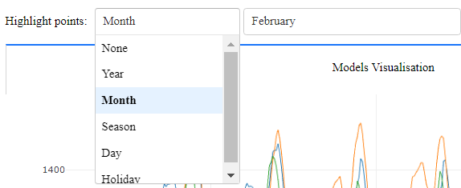

# Short Term Electricity Load Forecasting Visualisation and Interaction Tool

The project is a software solution that provides an interactive data visualisation suite to support research in the area of short-term electricity load forecasting.  The intended users for this application are an educational and industrial audience. Users are able to discover patterns and characteristics in the data through dynamic visualisations of historical load data. Different load forecasting models are incorporated into the solution. The visualisation of forecasting models enable a systematic performance comparison of each model’s load forecasting accuracy.

## Table of contents

* [Developer Installation](#developer-installation)
* [Data Contract](#data-contract) 
* [Preprocessing Data](#preprocessing-data)
* [Running the application](#running-the-application)
* [Running Unit Tests](#running-unit-tests)
* [Features](#features)

## Developer Installation
Requirements
* Anaconda https://www.anaconda.com/download/ (Python >3.7)

Open Anaconda prompt and enter:
```
cd <project-install-directory>\short-term-load-forecasting-visualisation-and-interaction-tool
```

Create a virtual Python environment containing all the solution dependencies:
```
conda env create -f environment.yml
```

Activate the virtual environment:
```
conda activate load_forecasting_env
```

Run the application:
```
python run.py
```

## Data Contract
Requirements for data:
* File must be placed into data\load_data
* File must be CSV file type

Field format:

| Field Name   | Required | Description                         | Format           | Example       |
|--------------|----------|-------------------------------------|------------------|---------------|
| Date         | Y        | The date and time of the load entry | dd/MM/yyyy hh:mm | 6/30/18 22:30 |
| Load         | Y        | The load entry value                | Numeric, in MW   | 780.174       |
| Other Fields | N        | Other explanatory variables         | Numeric          |               |

## Preprocessing Data
### Preprocessing Data for Highlighting Functionality
Load data must must be preprocessed to be able to use the data point highlighting functionality that leverages variables derived from the load entry date.

#### Fields added after preprocessing
| Field Name | Description                                                                                | Format                                     | Example        |
|------------|--------------------------------------------------------------------------------------------|--------------------------------------------|----------------|
| Year       | Year of the load entry                                                                     | yyyy                                       | 2019           |
| Month      | Month of the load entry                                                                    | m (1-12 January to December)               | 11             |
| Season     | Meteorological season of the load entry (Northern Hemisphere)                              | 1: Spring, 2: Summer, 3: Autumn, 4: Winter | 3              |
| Day        | Weekday of the load entry                                                                  | 0-6: Monday to Sunday                      | 4              |
| Is_Weekend | Indicates whether the load entry is on a weekend                                           | boolean                                    | False          |
| Holiday    | States the location specific holiday of the load entry using the Python library 'holidays' | string object                              | New Year's Day |

### Preprocessing Data for Regression Models
Load data can be preprocessed to be able to add regression models to the data. 
Regression models and their variables are defined through a JSON configuration file. 
The variables the models need are added to the data as part of a preprocessing step.

#### Data configuration file structure example
```javascript
{
  "models": { //list of regression models
    "Test Model": { //Name of the model in the solution
      "description": "ABCDEFG", //optional: a textual description of the model e.g source, explanation of variables chosen
      "training": { //optional: the date day range the model was trained on
        "start_date": "2015-01-01", //YYYY-MM-DD - what the start date picker will default to
        "end_date": "2016-01-01" //YYYY-MM-DD - what the end date picker will default to
      },
      "variables": { //list of variables the model will use: the magnitude of the variable
        "Temperature Last Day": { //name of the variable
          "column": "Temperature", //column in the data to use for the displacement
          "displacement_unit": "Days", //what unit to displace the variable (Half Hours, Hours, Days, Weeks, Months, Years)
          "displacement_value": 1 //magnitude of the displacement
        }
      },
      "differential variables": { //list of variables the model will use: the result of base variable - displaced variable
        "Wind Speed Difference Last Day": {
          "column": "Wind speed",
          "displacement_unit": "Days",
          "displacement_value": 1
        }
      },
      "correction variable": { //one variable the model will use other variables to correct the difference it has from the base variable
        "Load Last Day": {
          "column": "Load",
          "displacement_unit": "Days",
          "displacement_value": 1
        }
      }
    }
  }
}
```

#### Variable guidelines
* Variables should not be named 'None'
* If there is a correction variable there must be at least one variable or differential variable.

### Requirements for preprocessing
Requirements for preprocessing:
* Load data CSV file must be placed into the folder 'preprocessing'
* File must conform to the data contract field names and types
* If exists, the load data configuration JSON file must be placed into the folder 'preprocessing'
* Configuration file must conform to the configuration structure

### Steps to preprocess
Navigate to the preprocessing program:
```
cd <project-install-directory>\short-term-load-forecasting-visualisation-and-interaction-tool\preprocessing
```
Run the preprocessing program:
```
python process_csv.py
```

* Follow the console steps and find the CSV file in the program directory named as 'filename_processed.CSV'
* Move 'filename_processed.CSV' and (if exists) config file to \short-term-load-forecasting-visualisation-and-interaction-tool\data\load_data
* Rename 'filename_processed.CSV' to 'filename.CSV' 
* (if exists) Rename config file to 'filename_config.JSON'

## Running the application
Navigate to the preprocessing program:
```
cd <project-install-directory>\short-term-load-forecasting-visualisation-and-interaction-tool\preprocessing
```
Run the program in debug mode (Development):
```
python run.py debug
```
Run the program in production mode (Deployment):
```
python run.py
```

## Running unit tests
Run all unit tests:
```
coverage run -m unittest discover -p "*_test.py"
```
Generate a command line code coverage report:
```
coverage report -i
```
Generate an HTML code coverage report in /htmlcov :
```
coverage html -i
```
## Features
### Output
#### Visualise load graph with model load forecasts superimposed


#### Error distribution graph


#### Load Forecasting performance metrics


### Interaction
#### Changing the range of the load dataset to visualise

* Change the start date and end date.
* Choose the date value type to increment/decrement the range of visualised data by
* Increment/decrement the range of visualized data

#### Constructing a load forecasting model to generate forecasts
##### Displacement Model Construction

* Change the value of displacement
* Change the date value type of displacement
* Add the model to the visualisations

##### Linear Regression Model Construction

* Select the linear regression model from the dropdown
* View a description and the input variables of the model selected
* Choose what range of the load dataset used to train the linear regression model - may be set by default in the configuration
* Set the name of the linear regression model to be included in the legend of the visualisations
* Add the model to the visualisations

#### Manage the list of models added

* View a list of the models added 
* Select a model and remove it from the visualisations

#### Highlight data points

* Choose day type variable
* Choose type of day value to highlight

#### Changing the range of the load dataset to use as test data for performance metrics and error distribution visual comparison

* Change the start date and end date

#### Adding graph of a load dataset variable for comparison with the load visualisation graph

* Search for variable
* Select variable
* Select 'None' to remove the characteristics graph
